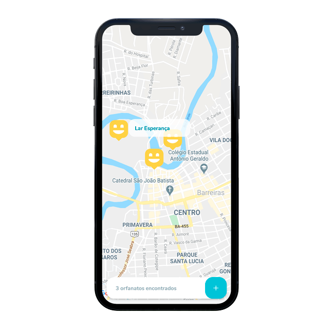
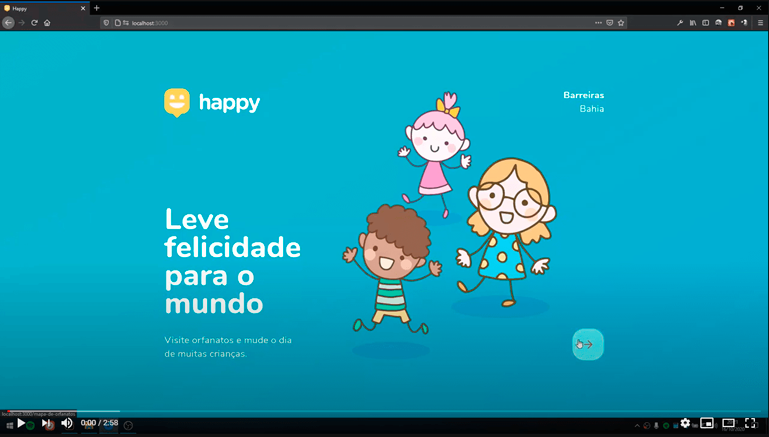

<h1 align="center">
    
</h1>
<p align="center">
  <a href="#-sobre-o-projeto">Sobre o projeto</a>&nbsp;&nbsp;&nbsp;|&nbsp;&nbsp;&nbsp;
  <a href="#-tecnologias">Tecnologias</a>&nbsp;&nbsp;&nbsp;|&nbsp;&nbsp;&nbsp;
  <a href="#-como-utilizar">Como utilizar</a>&nbsp;&nbsp;&nbsp;|&nbsp;&nbsp;&nbsp;
  <a href="#-como-contribuir">Como contribuir</a>&nbsp;&nbsp;&nbsp;|&nbsp;&nbsp;&nbsp;
  <a href="#-licença">Licença</a>
</p>
<p align="center">
	
</p>
<p align="center">
  
</p>


## 💡 Sobre o projeto

O Happy conecta os moradores de sua cidade com as casas de acolhimento institucional. O nome Happy é um trocadilho com a palavra Happy (felicidade, em inglês) e App (de aplicativo).


Criado durante a NLW#3, créditos a [Rocketseat](https://github.com/Rocketseat) 💜.

**Vídeo demo**

[](https://www.youtube.com/watch?v=mIZyBNr6heA "Happy")

## 🛸 Tecnologias

* [Typescript](https://www.typescriptlang.org)
* [NodeJs](https://nodejs.org/en/)
* [ReactJs](https://reactjs.org)
* [React Native](https://reactnative.dev)
* [Expo](https://expo.io)


## ⚙️ Como utilizar

Clone o repositório:

```bash
git clone https://github.com/ViniciusMazon/happy-nlw3.git
```

Instale as dependência em cada diretório (API, Web e Mobile) rodando o comando: 

```bash
yarn
```

No diretório da Api, execute o comando abaixo para rodar as migrations e criar as tabelas no banco de dados:

```bash
yarn typeorm migration:run
```

No diretório Mobile/services, edite o arquivo api.ts e adicione o IP da sua máquina seguindo o exemplo abaixo:

```javascript
const api = axios.create({
  baseURL: 'http://SEUIP:3333',
});
```

Instale o aplicativo do Expo em seu celular:

* [Android](https://play.google.com/store/apps/details?id=host.exp.exponent&hl=pt&gl=US)
* [iOS](https://apps.apple.com/br/app/expo-client/id982107779)

Rode o projeto utilizando o comando ``yarn dev`` para API e ``yarn start`` para a Web e Mobile. No mobile, será aberta uma janela no seu navegador contendo um QR Code, basta utilizar o aplicativo do Expo que você baixou para rodar o projeto em seu celular. 😁


## 🖖🏻 Como contribuir

- Faça um fork desse repositório;
- Clone esse repositório em sua máquina: `https://github.com/ViniciusMazon/happy-nlw3.git`
- Cria uma branch com a sua feature: `git checkout -b minha-feature`;
- Faça commit das suas alterações: `git commit -m 'feat: Minha nova feature'`;
- Faça push para a sua branch: `git push origin minha-feature`.

Depois que o merge da sua pull request for feito, você pode deletar a sua branch.


## 📃 Licença

Esse projeto está sob a licença MIT. Veja o arquivo LICENSE para mais detalhes.


---


Feito com 🖤 por Vinicius Mazon durante o evento Next Level Week#3.

